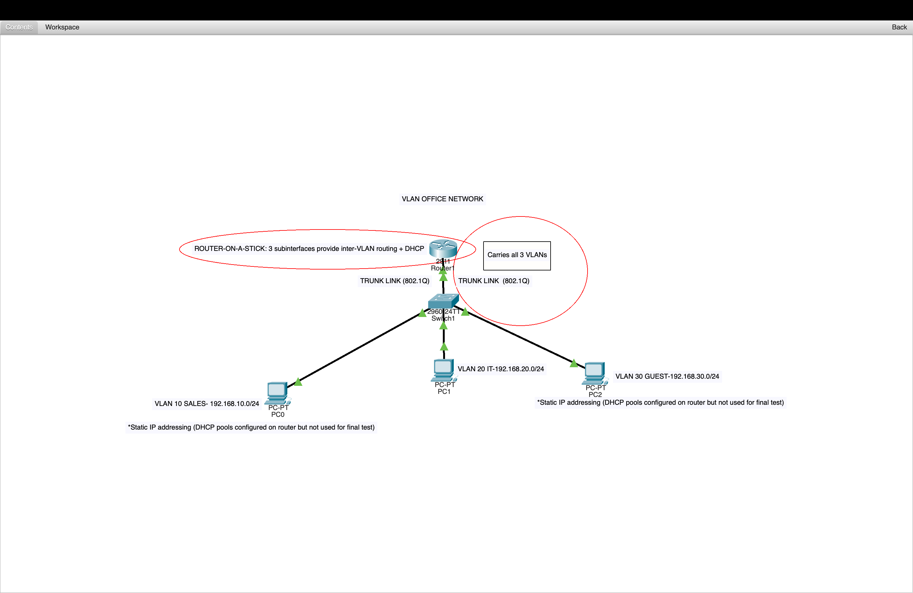

# VLAN Office Network (Packet Tracer)

A small office network built in Cisco Packet Tracer, demonstrating VLAN
segmentation, trunking, and inter-VLAN routing using a router-on-a-stick
configuration.

## Topology



One router, one switch, and three PCs — each PC represents a different
department on its own VLAN, all routed through a single router interface.

## Design

| VLAN | Department | Subnet           | Gateway (router subinterface) |
|------|-----------|-------------------|-------------------------------|
| 10   | Sales     | 192.168.10.0/24   | 192.168.10.1                  |
| 20   | IT        | 192.168.20.0/24   | 192.168.20.1                  |
| 30   | Guest     | 192.168.30.0/24   | 192.168.30.1                  |

**Why VLANs:** separating departments onto their own broadcast domains is
standard practice for office networks — it limits broadcast traffic, adds a
layer of isolation between departments, and lets each group be managed
independently.

**Why router-on-a-stick:** rather than running a separate cable per VLAN
from the switch to the router, a single trunk link (802.1Q) carries traffic
for all three VLANs. The router uses three logical subinterfaces
(`G0/0.10`, `G0/0.20`, `G0/0.30`), each tagged for its VLAN and acting as
that VLAN's default gateway. This is the standard approach for small
networks that don't need a Layer 3 switch.

**DHCP vs. static IP:** DHCP pools are configured on the router for all
three VLANs. For the final connectivity test, PCs were assigned static IPs
instead, to isolate and confirm the routing/trunking configuration
independently of DHCP behavior.

## Configuration highlights

Switch — VLANs and port assignment:
```
vlan 10
name SALES
vlan 20
name IT
vlan 30
name GUEST

interface fastEthernet 0/1
switchport mode access
switchport access vlan 10

interface fastEthernet 0/24
switchport mode trunk
```

Router — subinterfaces (router-on-a-stick):
```
interface gigabitEthernet 0/0.10
encapsulation dot1Q 10
ip address 192.168.10.1 255.255.255.0
```

## Testing

Verified connectivity in both directions:
- Each PC can reach its own VLAN's gateway
- Cross-VLAN traffic (e.g. PC0 on Sales → PC1 on IT) successfully routes
  through the router, confirming inter-VLAN routing is working end-to-end

## Files

- `VLAN_Office_Network.pkt` — the Packet Tracer project file (open with
  Cisco Packet Tracer to inspect or run directly)
- `topology.png` — annotated topology diagram
- `ping-test.png` — successful cross-VLAN ping proving the network works

## What this demonstrates

- VLAN creation and port assignment on a switch
- 802.1Q trunking between a switch and router
- Router-on-a-stick inter-VLAN routing using subinterfaces
- DHCP pool configuration
- Basic network troubleshooting (isolating whether a failure is at the
  switch, trunk, or router layer)
